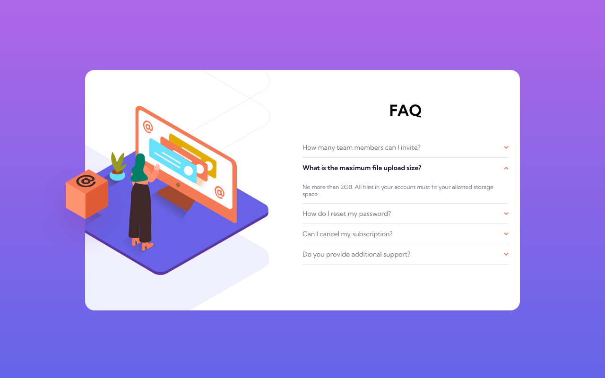

# Frontend Mentor - FAQ accordion card solution

This is a solution to the [FAQ accordion card challenge on Frontend Mentor](https://www.frontendmentor.io/challenges/faq-accordion-card-XlyjD0Oam). Frontend Mentor challenges help to improve coding skills by building realistic projects. Frontend Mentor provides design specifications and assets, all code is written by me.

## Table of contents

### Screenshot

### Links

- Live Site URL: [Live](https://kennyputman.github.io/faq-accordion-card/)

## My process

### Built with

- Vanilla HTML, CSS, and a little bit of javascript
